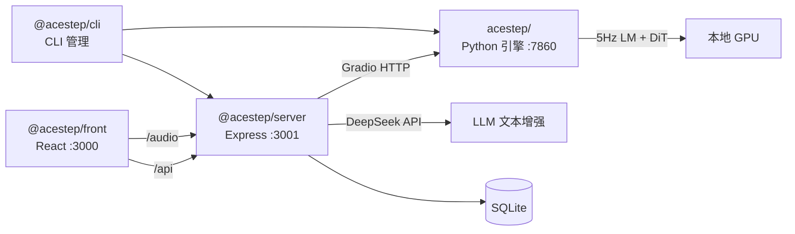

<h1 align="center">ACE-Step</h1>

<p align="center">
  <strong>本地 AI 音乐生成全栈工具</strong><br>
  <em>Python 引擎 + Node.js 编排 + React 前端 · 5 包 Monorepo</em>
</p>

<p align="center">
  
  
  
  <a href="https://github.com/kuaizhongqiang/ACE-Step-1.5/actions/workflows/ci.yml"></a>
</p>

---

## 📋 项目定位

**ACE-Step** 是基于 [ACE-Step 1.5](https://github.com/ace-step/ACE-Step-1.5) 的 Fork，将 Python 音乐引擎、Express 中间层、React 前端整合为 **5 包 Monorepo**，专注于：

- **Monorepo** — 一个 repo 包含引擎 + 服务 + 前端 + CLI + 共享类型，开箱即用
- **CLI 管理** — `@acestep/cli` 统一管理 Python 引擎和 Express 服务
- **DeepSeek API** — 文本增强走远程 API，释放 GPU 显存给 DiT
- **中文优先** — 默认中文界面和文档

## 🏗 架构



| 包 | npm 名 | 技术栈 | 职责 |
|---|--------|--------|------|
| **引擎** | — | Python 3.11+, PyTorch, Gradio | DiT 音频生成、5Hz LM 编码 |
| **共享类型** | `@acestep/shared` | TypeScript（零依赖） | 跨包类型定义 |
| **引擎通信** | `@acestep/engine` | TypeScript, Gradio Client | Python 引擎 HTTP 封装 |
| **服务** | `@acestep/server` | Express 4, TypeScript, SQLite | API 路由、生成队列、DeepSeek 集成 |
| **前端** | `@acestep/front` | React 19, Vite, TailwindCSS | 音乐生成界面、播放器、歌曲库 |
| **CLI** | `@acestep/cli` | Node.js .mjs | 服务管理、生成命令、配置管理 |

## 🚀 快速开始

### 前置条件

- Python 3.11+（[uv](https://astral.sh/uv) 包管理）
- Node.js ≥ 18
- NVIDIA GPU（推荐 ≥12GB VRAM）

### 安装

```bash
# 1. 克隆仓库
git clone https://github.com/kuaizhongqiang/ACE-Step-1.5.git
cd ACE-Step-1.5

# 2. 安装 Python 依赖
uv sync

# 3. 安装 Node.js 依赖（workspaces）
npm install

# 4. 配置环境变量
cp .env.example .env
# 编辑 .env，填入 DEEPSEEK_API_KEY 等

# 5. 下载模型（首次运行自动下载，或手动指定）
# 模型默认存放于 checkpoints/ 目录
```

### 启动

```bash
# 一键启动全部（Python 引擎 + Express + 前端）
node packages/cli/src/cli.mjs start

# 或分别启动
uv run acestep                                       # Gradio UI :7860
npm run dev -w packages/server                       # Express API :3001
npm run dev -w packages/front                        # React 前端 :3000
```

打开 http://localhost:3000 即可使用。

## 📖 CLI 命令

```bash
node packages/cli/src/cli.mjs help          # 帮助
node packages/cli/src/cli.mjs start         # 启动全部服务
node packages/cli/src/cli.mjs start engine  # 仅启动 Python 引擎
node packages/cli/src/cli.mjs start server  # 仅启动 Express 服务
node packages/cli/src/cli.mjs stop          # 停止服务
node packages/cli/src/cli.mjs status        # 运行状态
node packages/cli/src/cli.mjs health        # 健康检查
node packages/cli/src/cli.mjs logs -f       # 实时日志
node packages/cli/src/cli.mjs config        # 配置查看
node packages/cli/src/cli.mjs list styles   # 列出音乐风格
node packages/cli/src/cli.mjs generate "jazz" # CLI 生成音乐
```

## 🗺 API 路由

| 路径 | 方法 | 说明 |
|------|------|------|
| `/api/songs` | GET / POST | 歌曲列表 / 创建 |
| `/api/songs/:id` | GET / PUT / DELETE | 歌曲详情 / 更新 / 删除 |
| `/api/generate` | POST | 音乐生成 |
| `/api/playlists` | GET / POST | 播放列表 |
| `/api/search` | GET | 搜索 |
| `/health` | GET | 健康检查 |
| `/audio/:id` | GET | 音频文件 |

## 🎵 模型

| 模型 | 类型 | 参数量 | 用途 |
|------|------|--------|------|
| `acestep-v15-xl-base` | DiT 扩散模型 | 4B | 文本 → 音频波形 |
| `acestep-v15-turbo` | DiT 扩散模型 | 2B | 快速生成 |
| `acestep-5Hz-lm-1.7B` | 语言模型 | 1.7B | 文字 → 音频编码 |

> 模型权重存放于 `checkpoints/` 目录，已在 `.gitignore` 中排除。

## 📦 项目结构

```
ACE-Step-1.5/
├── acestep/                    # Python AI 引擎 (~590 .py)
│   ├── core/generation/        # 推理核心（~80 mixin 模块）
│   ├── models/                 # DiT 模型定义
│   ├── api/                    # FastAPI REST 服务
│   ├── training/               # 训练 v1 (Lightning)
│   └── ui/gradio/              # Gradio Web UI
├── packages/                   # Node.js 5 包 Monorepo
│   ├── shared/                 # @acestep/shared — 纯类型定义
│   ├── engine/                 # @acestep/engine — Python 引擎通信
│   ├── server/                 # @acestep/server — Express API + SQLite
│   ├── front/                  # @acestep/front — React 前端
│   └── cli/                    # @acestep/cli — CLI 管理工具
├── data/                       # 风格列表、数据集（权威位置）
├── docs/                       # 设计文档、迁移方案
├── .github/                    # CI 流水线 + Issue/PR 模板
├── checkpoints/                # 模型权重（gitignore）
├── cli.py                      # Python 生成向导
├── pyproject.toml              # Python 依赖（uv）
└── package.json                # Node.js workspace root
```

## 🔧 开发

```bash
# Python 测试
uv run python -m unittest discover -s . -p "*_test.py"

# 全部 TypeScript 类型检查
npm run typecheck

# 包级类型检查
npm run typecheck -w packages/shared
npm run typecheck -w packages/engine
npm run typecheck -w packages/server
npm run typecheck -w packages/front

# 前端构建
npm run build -w packages/front

# 环境安装
node packages/cli/src/cli.mjs install
```

## 🤝 贡献

### 工作流

1. 查看 [Issues](https://github.com/kuaizhongqiang/ACE-Step-1.5/issues) 和 [Milestones](https://github.com/kuaizhongqiang/ACE-Step-1.5/milestones)
2. Fork 仓库，创建功能分支：`feat/<issue>-<description>`
3. 遵循 [Conventional Commits](https://www.conventionalcommits.org/zh-hans/)：`feat(server): 添加播放列表导出`
4. 提交 PR，关联 Issue，打版本 label（`patch` / `minor` / `major`）
5. CI 通过 + 代码审核后合并

### 规范

- Python: [AGENTS.md](AGENTS.md) + [CODEBUDDY.md](CODEBUDDY.md)
- TypeScript: 严格模式，类型检查通过 `tsc --noEmit`
- 架构：[docs/DESIGN.md](docs/DESIGN.md)

## 🙏 致谢

本项目基于 [ACE-Step 1.5](https://github.com/ace-step/ACE-Step-1.5)，由 ACE Studio 和 StepFun 联合开发。

## 📖 引用

```bibtex
@misc{gong2026acestep,
    title={ACE-Step 1.5: Pushing the Boundaries of Open-Source Music Generation},
    author={Junmin Gong, Yulin Song, Wenxiao Zhao, Sen Wang, Shengyuan Xu, Jing Guo},
    howpublished={\url{https://github.com/ace-step/ACE-Step-1.5}},
    year={2026},
    note={GitHub repository}
}
```

## 📄 许可证

MIT License · Fork 自 [ACE-Step 1.5](https://github.com/ace-step/ACE-Step-1.5) (MIT)

Copyright (c) 2026 ACE-Step · Maintained by [kuaizhongqiang](https://github.com/kuaizhongqiang)
