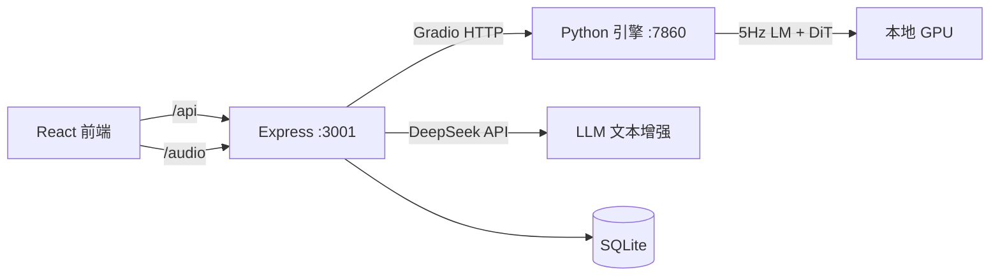

<h1 align="center">ACE-Step</h1>

<p align="center">
  <strong>本地 AI 音乐生成全栈工具</strong><br>
  <em>Python 引擎 + Node.js 编排 + React 前端 · 三合一单体仓库</em>
</p>

<p align="center">
  
  
  
</p>

---

## 📋 项目定位

**ACE-Step** 是基于 [ACE-Step 1.5](https://github.com/ace-step/ACE-Step-1.5) 的 Fork，将 Python 音乐引擎、Express 中间层、React 前端整合为单体仓库，专注于：

- **单体仓库** — 一个 repo 包含引擎 + 服务 + 前端，开箱即用
- **CLI 管理** — Node.js CLI 统一管理 Python 引擎和 Express 服务
- **DeepSeek API** — 文本增强走远程 API，释放 GPU 显存给 DiT
- **中文优先** — 默认中文界面和文档

## 🏗 架构



| 层 | 技术栈 | 职责 |
|---|--------|------|
| **引擎** | Python 3.11+, PyTorch, Gradio | DiT 音频生成、5Hz LM 编码 |
| **服务** | Express 4, TypeScript | API 路由、生成队列、DeepSeek 集成 |
| **前端** | React 19, Vite, TailwindCSS | 音乐生成界面、播放器、歌曲库 |
| **CLI** | Node.js .mjs | 服务管理、生成命令、配置管理 |

## 🚀 快速开始

### 前置条件

- Python 3.11+ ([uv](https://astral.sh/uv) 包管理)
- Node.js ≥ 18
- NVIDIA GPU（推荐 ≥12GB VRAM）

### 安装

```bash
# 1. 克隆仓库
git clone https://github.com/kuaizhongqiang/ACE-Step-1.5.git
cd ACE-Step-1.5

# 2. 安装 Python 依赖
uv sync

# 3. 安装 Node.js 依赖
npm install && cd server && npm install && cd ../ui && npm install && cd ..

# 4. 配置环境变量
cp env.example .env
# 编辑 .env，填入 DEEPSEEK_API_KEY 等

# 5. 下载模型（首次运行自动下载，或手动指定）
# 模型默认存放于 checkpoints/ 目录
```

### 启动

```bash
# 一键启动全部（Python 引擎 + Express + 前端）
node server/cli.mjs dev

# 或分别启动
uv run acestep                           # Gradio UI :7860
cd server && npx tsx src/index.ts        # Express API :3001
cd ui && npx vite --port 3000            # React 前端 :3000
```

打开 http://localhost:3000 即可使用。

## 📖 CLI 命令

```bash
node server/cli.mjs help          # 帮助
node server/cli.mjs start         # 后台启动 Express
node server/cli.mjs start engine  # 启动 Python 引擎
node server/cli.mjs stop          # 停止服务
node server/cli.mjs status        # 运行状态
node server/cli.mjs health        # 健康检查
node server/cli.mjs logs -f       # 实时日志
node server/cli.mjs config        # 配置查看
node server/cli.mjs list styles   # 列出音乐风格
node server/cli.mjs generate "jazz" # CLI 生成音乐
```

## 🗺 API 路由

| 路径 | 说明 |
|------|------|
| `/api/songs` | 歌曲 CRUD |
| `/api/generate` | 音乐生成 |
| `/api/playlists` | 播放列表 |
| `/api/search` | 搜索 |
| `/health` | 健康检查 |
| `/audio/` | 音频文件 |

## 🦁 模型

| 模型 | 类型 | 参数量 | 用途 |
|------|------|--------|------|
| `acestep-v15-xl-base` | DiT 扩散模型 | 4B | 文本 → 音频波形 |
| `acestep-v15-turbo` | DiT 扩散模型 | 2B | 快速生成 |
| `acestep-5Hz-lm-1.7B` | 语言模型 | 1.7B | 文字 → 音频编码 |

> 模型权重存放于 `checkpoints/` 目录，已在 `.gitignore` 中排除。

## 📦 项目结构

```
ACE-Step-1.5/
├── acestep/          # Python AI 引擎
├── openrouter/       # OpenRouter API 服务
├── server/           # Express 中间层 + CLI
├── ui/               # React 前端
├── data/             # 风格列表、数据集
├── docs/             # 文档
├── checkpoints/      # 模型权重（gitignore）
├── cli.py            # Python 生成向导
├── pyproject.toml    # Python 依赖
└── package.json      # Node.js 依赖
```

## 🔧 开发

```bash
# Python 测试
uv run python -m unittest discover -s acestep -p "*_test.py"

# 前端类型检查
npx tsc --noEmit -p ui/tsconfig.json

# 后端类型检查
cd server && npx tsc --noEmit
```

## 🙏 致谢

本项目基于 [ACE-Step 1.5](https://github.com/ace-step/ACE-Step-1.5)，由 ACE Studio 和 StepFun 联合开发。

## 📖 引用

```bibtex
@misc{gong2026acestep,
    title={ACE-Step 1.5: Pushing the Boundaries of Open-Source Music Generation},
    author={Junmin Gong, Yulin Song, Wenxiao Zhao, Sen Wang, Shengyuan Xu, Jing Guo},
    howpublished={\url{https://github.com/ace-step/ACE-Step-1.5}},
    year={2026},
    note={GitHub repository}
}
```

## 📄 许可证

MIT License · Fork 自 [ACE-Step 1.5](https://github.com/ace-step/ACE-Step-1.5) (MIT)

Copyright (c) 2026 ACEStep · Fork maintained by [kuaizhongqiang](https://github.com/kuaizhongqiang)
